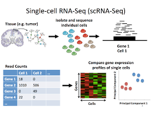

```{r setup, include=FALSE}
knitr::opts_chunk$set(echo = TRUE)
```

## scRNASeq




## Demultiplexing


### Cell Hashing

Involves the labelling of cells with tags (HTO,LMO,CMO) prior to being pooled and sequenced.
Sequencing of labels returns a tag counts expression matrix of dimensions # tags x # cells

Example matrix:

````{r}

tags<-matrix(rpois(4*10,lambda=5),4,10,dimnames = list(paste(rep("Hashtag",4),1:4,sep=""),paste(rep("Cell"),1:10,sep="")))
tags
````


Overall:

````{r}

library(ComplexHeatmap)
Heatmap(tags,cluster_rows=FALSE)

````

Hashtag counts across cells

````{r}

mat<-tags[,1]
names(mat)<-paste(rep("Hashtag"),1:4,sep="")
barplot(mat)
````


Hashtag counts across a Hashtag (bimodal distriution)

````{r}
set.seed(1)
bg<-rnbinom(n=500,size=5,mu=2)
sig<-rnbinom(n=400,size=10,mu=40)
hist(c(bg,sig))

````

### SNPs


````{r}
set.seed(1)
n=c(50,50,50,50)
nsnps=20
snps_mat<-c()

for (i in seq_along(n)) {
  snp<-rbinom(nsnps,1,0.3)
  h<-matrix(rep(snp,n[i]),nsnps,n[i])
  snps_mat<-cbind(snps_mat,h)
}
snps_mat[snps_mat==0]<-c(-1)
tot_mixed<-snps_mat[,sample(1:sum(n))]

Heatmap(snps_mat,cluster_columns=FALSE,cluster_rows=FALSE)
Heatmap(tot_mixed,cluster_columns = FALSE,cluster_rows=FALSE)
Heatmap(tot_mixed,cluster_columns = TRUE,cluster_rows=FALSE,row_gap = unit(1, "mm"),
    column_gap = unit(1, "mm"),column_split=4)

````

Sequencing depth, ambient RNA, mutations


## References


## Sessioninfo

````{r}

sessionInfo()

````